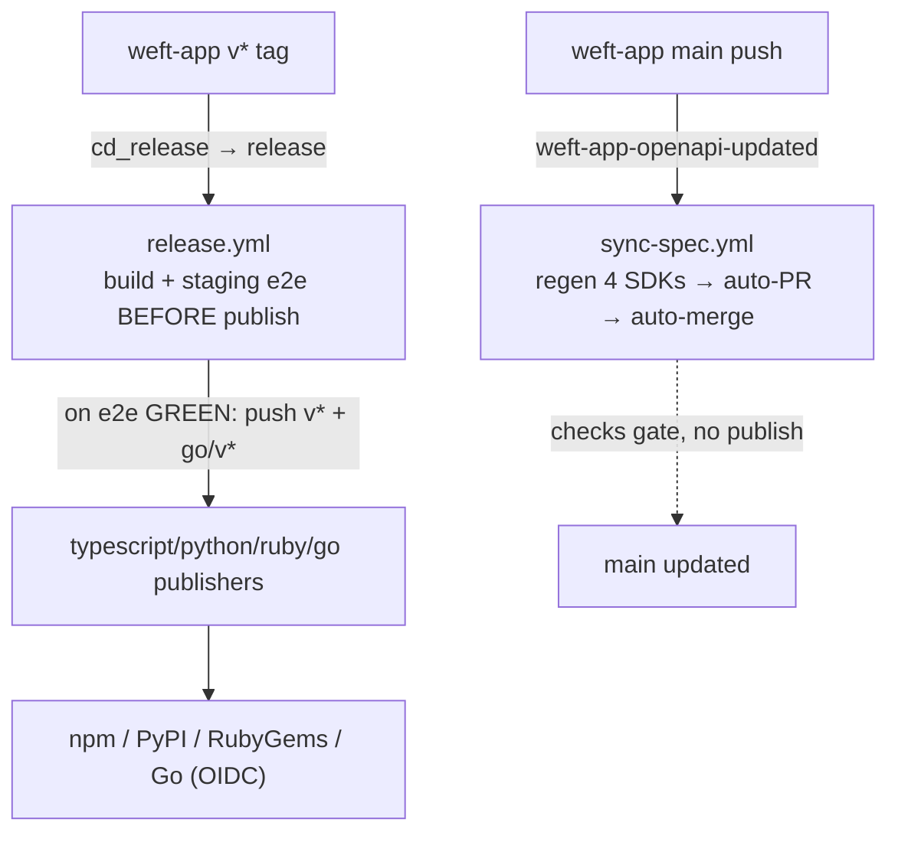

# weft-sdk Release Pipeline — Ops Runbook

> When the pipeline breaks at 3am, debug from **here**. This is the operational
> surface only — restart commands, "this step failed → look here", and the
> trigger map. The *why* (design rationale, auth posture, invariants) lives in
> `cto-os/reference/architecture/sdk-pipeline.md`; don't duplicate it, read it
> when you need the reasoning.
>
> Source of truth for what can fail: the workflow YAML in `.github/workflows/`
> (`sync-spec.yml`, `release.yml`, `typescript.yml`, `python.yml`, `ruby.yml`,
> `go.yml`, `e2e.yml`, `dispatch-sdk-updated.yml`).

---

## The two flows (don't confuse them)

| Flow | Trigger | Workflow | Produces |
|---|---|---|---|
| **Spec sync** | `weft-app` push to `main` → `weft-app-openapi-updated` dispatch | `sync-spec.yml` | Auto-PR regenerating all 4 SDKs, auto-merged on green. **No package published.** |
| **Release** | `weft-app` `v*` product tag → `cd_release` → `release` dispatch | `release.yml` | After staging e2e passes: commit bump + push `v*`/`go/v*` tags → publishers run. **Packages published.** |

Pushing an API change keeps SDK *source* current (sync). A package publishes
**only** when someone cuts a `weft-app` `v*` tag (release). If you expected a
published package and only see an auto-PR, you ran sync, not release.



---

## Trigger map — who fires what

- **`weft-app` push to main** → `weft-app-openapi-updated` repository_dispatch → `sync-spec.yml`.
- **`weft-app` `v*` tag** → `weft-app/cd_release.yml` → `release` repository_dispatch → `release.yml`.
- **Push to `weft-sdk` main / `v*` tag / `go/v*` tag** → per-language workflows (`typescript.yml`, `python.yml`, `ruby.yml`, `go.yml`); they build+test on main pushes and **publish only on tag push** (`v*`, and `go/v*` for Go).
- **PR to main** → `e2e.yml` staging job + per-language build/test = the merge gate.
- All workflows also expose **`workflow_dispatch`** for manual re-runs.

---

## "This step failed → look here"

### sync-spec.yml (spec sync)

| Step | If it fails | Where to look / fix |
|---|---|---|
| **Fetch spec from dispatch payload** | `openapi_url` missing or URL mismatch | The dispatch payload from `weft-app` is malformed. Check `weft-app` `cd_openapi-dispatch`. URL must be `…/weft-app/contents/docs/openapi.yaml?ref=<app_sha>`. |
| **Validate dispatch provenance** | `app_sha`/`openapi_sha256`/version regex fail, or fetched SHA-256 ≠ payload | The fetched spec doesn't match the dispatched digest (race or wrong ref). Re-run the dispatch from `weft-app` for the correct SHA; do not hand-edit. |
| **Align package versions** (`bump-version.sh`) | A version site didn't update | `./scripts/bump-version.sh <X.Y.Z>` locally to reproduce; check all 7 version sites. |
| **Generate SDKs** (`generate-all.sh`) | "dirty file set did not grow" error | A generator silently no-oped. Run `./scripts/generate-{typescript,python,ruby,go}.sh` individually against `spec/openapi.yaml` to find the dead one. |
| **Verify generated output** (`test-sdk.sh`) | Generated code broken | `./scripts/test-sdk.sh` locally on the regenerated tree. |
| **Generate OpenAPI changelog** | `continue-on-error: true` → never blocks | Non-fatal. Logs only. Reproduce: `./scripts/generate-changelog.sh origin/main`. |
| **Mint weft-sdk App token** | Token mint fails | `APP_ID`/`APP_PRIVATE_KEY` per-repo secrets on `weft-sdk`; App id `3904593` install scoped to weft-sdk. |
| **Open or update auto-PR** | push/PR fails | force-with-lease conflict on `sdk-candidate/weft-app-<short_sha>` or App token lost `contents`/`pull-requests` write. |
| **Enable auto-merge** | "Found N>1 open PRs … refusing" | Ambiguous-PR guard tripped. Close the stale candidate PR for that branch, then re-run. |

### release.yml (release)

| Step | If it fails | Where to look / fix |
|---|---|---|
| **Validate dispatch payload** | semver / sha / `openapi_version==version` mismatch, or tag already remote | Version coherence broken in `weft-app` (`VERSION` vs `openapi.yaml info.version` vs tag), or you're re-cutting an existing tag. Fix in `weft-app`, re-tag. Re-runs are safe — it refuses if `v*`/`go/v*` already exists. |
| **Generate / Build / Run tests** (4 langs) | Build or test red | Reproduce locally: `./scripts/generate-all.sh` then build/test the failing language. **No tag pushed, nothing published.** |
| **Assert openapi_sha256 matches built spec** | Digest mismatch | The spec the release was built from ≠ the dispatched spec. Staging spec drifted. Re-dispatch from the correct `weft-app` commit. |
| **Run TypeScript staging e2e** | e2e red against `staging.weft.network` | **This is the pre-publish gate.** Red ⇒ no tag, no publish, users keep previous SDK. Recovery = **fix-forward** in `weft-app`/spec, bump, re-tag. Check staging health + `scripts/e2e-typescript-staging.mjs`. |
| **Mint App token / Commit bump + tags** | token or push fails | App token `contents: write` on weft-sdk. The push is single all-or-nothing (`HEAD:main v* go/v*`). |

### Publishers (typescript / python / ruby / go)

| Symptom | Where to look |
|---|---|
| Tag pushed but package not on registry | The tag-gated publish job. `v*` fires npm/PyPI/RubyGems; **Go needs `go/v*`** (separate tag). |
| OIDC / trusted-publishing auth error | Publisher job's `id-token: write` + `attestations: write` (scoped to the publish job only); registry trusted-publisher config. No registry tokens exist — don't add one. |
| Go module not indexed | `go.yml` `pkg.go.dev` indexing nudge; provenance attest on the source tarball. |

---

## Restart / re-run commands

```sh
# Re-run a whole workflow (uses workflow_dispatch on each):
gh workflow run sync-spec.yml -R weft-labs/weft-sdk
gh workflow run release.yml   -R weft-labs/weft-sdk    # rare; release is normally weft-app-driven

# Re-run a specific failed run (keeps the original dispatch payload):
gh run list -R weft-labs/weft-sdk --workflow sync-spec.yml
gh run rerun <run-id> -R weft-labs/weft-sdk
gh run rerun <run-id> -R weft-labs/weft-sdk --failed   # only failed jobs

# Re-trigger spec sync from weft-app (the normal path — never hand-edit a candidate):
#   push the API change to weft-app main, or re-run weft-app's openapi-dispatch.

# Re-cut a release: it ALWAYS starts on weft-app, never by tagging weft-sdk.
#   On weft-app: git tag vX.Y.Z <merge-sha> && git push origin vX.Y.Z
#   release.yml refuses if v*/go/v* already exists remotely, so this is safe.

# Reproduce pipeline steps locally:
./scripts/bump-version.sh X.Y.Z      # align all 7 version sites
./scripts/generate-all.sh            # regen 4 SDKs (fails if a generator no-ops)
./scripts/test-sdk.sh                # verify generated output
./scripts/generate-changelog.sh origin/main   # changelog (non-fatal in CI)
```

**Never tag `weft-sdk` by hand.** SDK version is lockstep with the `weft-app`
product tag. The full "how to cut a release" procedure lives in
`cto-os/reference/architecture/sdk-pipeline.md` → *How to Cut a Release*.

---

## Fast triage

- **Nothing happened after a `weft-app` change** → did you push to main (sync, auto-PR) or tag (release, publish)? Check `gh run list` on both repos.
- **Auto-PR opened but didn't merge** → required checks red on the candidate PR, or the ambiguous-PR guard tripped (close stale candidate PRs).
- **Release ran but published nothing** → almost always staging e2e red (the pre-publish gate). No tag = no publish. Fix-forward + re-tag on weft-app.
- **A package is missing while others published** → that language's tag-gated publish job, or (for Go) the missing `go/v*` tag.
- **Token/auth errors anywhere** → `APP_ID`/`APP_PRIVATE_KEY` per-repo secrets (weft-sdk + weft-app), `weft-release-bot` App `3904593` install scope; publishers use OIDC, not tokens.

---

## Related

- Architecture + rationale: `cto-os/reference/architecture/sdk-pipeline.md`
- Active pipeline plan: `cto-os/plans/active/2026-05-27-sdk-release-pipeline-decoupled.md`
- Spec-sync auth spec: `cto-os/specs/sdk-pipeline/02-spec-sync-auth.md`
