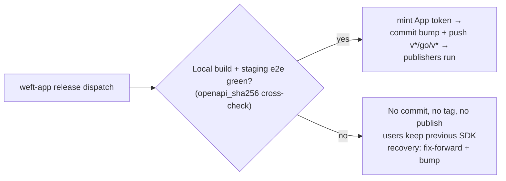

# SDK Pipeline Architecture — Event-Driven Release

> Visual reference for the SDK release pipeline, grounded in the live workflow
> YAML in `.github/workflows/` (`sync-spec.yml`, `release.yml`, `typescript.yml`,
> `python.yml`, `ruby.yml`, `go.yml`).
>
> **Active plans:**
> - Pipeline (event-driven, e2e-before-publish): [`plans/active/2026-05-27-sdk-release-pipeline-decoupled.md`](../../../cto-os/plans/active/2026-05-27-sdk-release-pipeline-decoupled.md)
> - Auth hardening (retire bot PAT → GitHub App + OIDC): [`plans/scoped/2026-05-28-s8-retire-bot-token-oidc-ghapp.md`](../../../cto-os/plans/scoped/2026-05-28-s8-retire-bot-token-oidc-ghapp.md)
>
> **Validated end-to-end:** v0.6.1 (2026-06-01).

---

## TL;DR

The SDK pipeline separates **SDK source generation** from **registry publishing**,
and it is **event-driven**: `weft-app` dispatches GitHub `repository_dispatch`
events that drive spec sync and release. There are **no `.release-candidates/`
marker files** — a PR's own required-check status (per-language build/test +
staging e2e) is the gate for spec-sync, and the `release` workflow runs staging
e2e against the locally-built artifact *before* it pushes any tag.

Two flows:

1. **Spec sync** — `weft-app` pushes to main → `weft-app-openapi-updated`
   dispatch → `sync-spec.yml` regenerates all four SDKs, opens an auto-PR, and
   enables `gh pr merge --auto --squash`. The PR's checks are the gate.
2. **Release** — `weft-app`'s validated product tag → `cd_release` dispatches a
   `release` event → `release.yml` runs staging e2e against the locally-built
   TypeScript SDK, then (only on green) commits the version bump and pushes
   `v*` + `go/v*` tags. The tag push triggers the four tag-gated publishers.

Core invariant:

> No `v*`/`go/v*` tag is pushed — and therefore nothing publishes — until the
> locally-built SDK passes staging e2e against `staging.weft.network` for the
> exact spec the release was built from (`openapi_sha256` cross-check).

---

## Authentication & Provenance Posture (post-S8)

- **No PATs.** `WEFT_BOT_TOKEN` and `WEFT_SDK_DISPATCH_TOKEN` are retired.
- **Auth = `weft-release-bot` GitHub App** (App ID `3904593`). Every privileged
  git write (branch push, PR ops, auto-merge enable, commit + tag push) and the
  cross-repo private-spec read use short-lived (~1h, auto-revoked) **per-job
  installation tokens** minted via `actions/create-github-app-token@v2`
  (`app-id` + `private-key`, narrowed by `owner` / `repositories` /
  `permission-*`). Tokens are minted **just-in-time**, immediately before the
  step that needs them, to keep the exposure window tight.
- **Secrets are `APP_ID` and `APP_PRIVATE_KEY`**, configured as **per-repo
  secrets** on `weft-sdk` and `weft-app`. (An org-level selected-visibility
  attempt did not resolve at runtime; per-repo is the active config, root cause
  open — see `cto-os` memory.) The action uses app-id + private-key, so **no
  `id-token` permission is required to mint the App token.**
- **Publishing = OIDC trusted publishing with provenance/attestations** on all
  four registries — no long-lived registry tokens anywhere. Publisher
  workflows hold a top-level `permissions: contents: read` and grant
  `id-token: write` + `attestations: write` **only** on the job that publishes.
- **Git writes use an Authorization header** (`Basic` of base64
  `x-access-token:<token>`), never a token-in-URL, so git cannot echo a
  credential-bearing URL on a verbose remote rejection. Checkouts that must not
  retain `GITHUB_TOKEN` use `persist-credentials: false`.
- **Ambiguous-PR auto-merge guard** in `sync-spec.yml`: it lists open PRs for
  the candidate branch (`gh pr list --head … --base main --state open`) and
  `exit 1`s if more than one matches, refusing to auto-merge an ambiguous target.

---

## System Topology

```mermaid
flowchart TB
    subgraph app["weft-app"]
        app_main["main branch\nRails API + docs/openapi.yaml"]
        app_release["cd_release.yml\nvalidated product tag"]
    end

    subgraph ghapp["weft-release-bot GitHub App (id 3904593)"]
        mint["create-github-app-token@v2\nshort-lived installation tokens\nminted just-in-time"]
    end

    subgraph sdk["weft-sdk"]
        sync["sync-spec.yml\nregen 4 SDKs → auto-PR → auto-merge"]
        release["release.yml\nbuild + staging e2e BEFORE publish\nthen commit bump + push v*/go/v* tags"]
        ts_pub["typescript.yml (tag: v*)"]
        py_pub["python.yml (tag: v*)"]
        rb_pub["ruby.yml (tag: v*)"]
        go_pub["go.yml (tag: go/v*)"]
    end

    subgraph registries["SDK Registries — OIDC trusted publishing"]
        npm["npm @weft-labs/sdk\n--provenance"]
        pypi["PyPI weft-sdk\ngh-action-pypi-publish + attestations"]
        gems["RubyGems weft-sdk\nconfigure-rubygems-credentials@v2\n+ attest-build-provenance@v3"]
        go["Go module go/v*\nattest-build-provenance@v3 on src tarball"]
    end

    app_main -->|repository_dispatch:\nweft-app-openapi-updated| sync
    app_release -->|repository_dispatch:\nrelease\n(version, app_sha, openapi_sha256, openapi_version)| release

    sync -.->|mint weft-app contents:read\n(spec fetch)| mint
    sync -.->|mint weft-sdk contents:write + PRs:write\n(branch push / PR / auto-merge)| mint
    release -.->|mint weft-sdk contents:write\n(commit + tag push)| mint

    release -->|push v* + go/v* tags| ts_pub
    release --> py_pub
    release --> rb_pub
    release --> go_pub

    ts_pub --> npm
    py_pub --> pypi
    rb_pub --> gems
    go_pub --> go
```

---

## Spec-Sync Flow

`weft-app` push to main → regenerate all four SDKs → auto-PR gated by its own
checks → auto-merge on green. No marker file is written or read.

```mermaid
sequenceDiagram
    autonumber
    participant App as weft-app main
    participant Sync as weft-sdk sync-spec.yml
    participant Bot as weft-release-bot App
    participant Candidate as sdk-candidate/weft-app-<short_sha>
    participant Checks as Required checks (ts/py/ruby/go build+test + staging e2e)

    App->>Sync: repository_dispatch: weft-app-openapi-updated\n(openapi_url, app_sha, openapi_sha256, openapi_version)
    Sync->>Sync: checkout (persist-credentials: false)
    Sync->>Bot: mint App token — weft-app contents:read (just-in-time)
    Bot-->>Sync: short-lived installation token
    Sync->>App: GET docs/openapi.yaml via Contents API\nAuthorization: Bearer <app-token>
    Sync->>Sync: validate app_sha (40-hex), openapi_sha256 (64-hex),\nopenapi_version (semver); assert fetched SHA-256 == payload
    Sync->>Sync: bump-version.sh aligns 4 SDKs; generate-all.sh; test-sdk.sh
    Sync->>Bot: mint App token — weft-sdk contents:write + pull-requests:write
    Bot-->>Sync: short-lived installation token
    Sync->>Candidate: git push --force-with-lease (Authorization header, not token-in-URL)
    Sync->>Candidate: gh pr create/edit --base main
    Sync->>Sync: guard — gh pr list --head … --base main --state open;\nif COUNT > 1 exit 1
    Sync->>Candidate: gh pr merge --auto --squash
    Checks-->>Candidate: on green → squash-merge to main (no marker)
```

---

## Release Flow

`weft-app`'s validated product tag dispatches `release`. `release.yml` builds
the SDKs locally, runs staging e2e against the locally-built TypeScript
artifact, and only then commits the bump and pushes the tags that fire the
publishers. e2e red ⇒ no commit, no tag, no publish (recovery is fix-forward + bump).

```mermaid
sequenceDiagram
    autonumber
    participant AppRelease as weft-app cd_release.yml
    participant Release as weft-sdk release.yml
    participant Staging as staging.weft.network
    participant Bot as weft-release-bot App
    participant Tags as weft-sdk main + v*/go/v* tags
    participant Publishers as typescript/python/ruby/go publishers
    participant Registry as npm / PyPI / RubyGems / Go (OIDC)

    AppRelease->>Release: repository_dispatch: release\n(version, app_sha, weft_app_tag, openapi_sha256, openapi_version)
    Release->>Release: checkout main (persist-credentials: false)
    Release->>Release: validate payload (semver, 40-hex sha, 64-hex sha256,\nopenapi_version == version); refuse if v*/go/v* tag already remote
    Release->>Release: bump-version.sh (working tree only, NO commit yet)
    Release->>Release: install deps; generate-all.sh; build TS; run ts/py/ruby/go tests
    Release->>Release: compute SHA-256 of built spec/openapi.yaml
    Release->>Release: assert dispatched openapi_sha256 == built spec SHA-256\n(else staging spec != built spec → stop)
    Release->>Staging: TS staging e2e using ../typescript/dist (the artifact that will ship)
    Staging-->>Release: 200 + served OpenAPI SHA-256 matches
    Note over Release: Only past this point on e2e GREEN
    Release->>Bot: mint App token — weft-sdk contents:write (just-in-time)
    Bot-->>Release: short-lived installation token
    Release->>Tags: commit "release: v<version>"; tag v<version> + go/v<version>
    Release->>Tags: git push origin HEAD:main v<version> go/v<version>\n(single all-or-nothing push, Authorization header)
    Tags->>Publishers: tag push triggers tag-gated publish jobs
    Publishers->>Registry: OIDC trusted publish + provenance/attestations
```

Release failure rule:



---

## Responsibilities

| Component | Responsibility | Does Not Do |
|---|---|---|
| `weft-app/docs/openapi.yaml` | Canonical API contract | Publish SDK packages |
| `weft-app cd_openapi-dispatch` | On push to main: emits `weft-app-openapi-updated` with immutable provenance (`app_sha`, `openapi_sha256`, `openapi_version`, spec URL) | Test or release |
| `weft-app cd_release.yml` | On validated product tag: dispatches `release` to weft-sdk with `{version, app_sha, weft_app_tag, openapi_sha256, openapi_version}` | Generate or publish SDKs |
| `weft-release-bot` GitHub App (id `3904593`) | Source of all privileged tokens — short-lived per-job installation tokens minted just-in-time via `create-github-app-token@v2`, scoped by repo + permission, auto-revoked (~1h) | Persist credentials; run jobs |
| `APP_ID` / `APP_PRIVATE_KEY` (per-repo secrets on weft-sdk + weft-app) | App credentials used to mint installation tokens; no `id-token` permission needed | Be a PAT; sit at org level (org attempt unresolved) |
| `weft-sdk/sync-spec.yml` | Fetches private spec via App token, validates payload + spec digest, regenerates 4 SDKs (incl. Ruby `Gemfile.lock`), opens/updates auto-PR, enables auto-merge, guards against ambiguous PRs | Write directly to `main`; write any marker file |
| Candidate branch (`sdk-candidate/weft-app-<short_sha>`) | Holds generated SDK output for one `weft-app` SHA; merged via PR checks | Represent multiple app SHAs |
| `weft-sdk/release.yml` | Builds SDKs locally with bumped version, runs staging e2e on the locally-built TS artifact, cross-checks `openapi_sha256`, then (on green) commits bump + pushes `v*`/`go/v*` tags | Tag or publish before e2e is green; pick mutable `main` blindly |
| `typescript.yml` / `python.yml` / `ruby.yml` | Tag-gated (`v*`) publish to npm / PyPI / RubyGems via OIDC trusted publishing + provenance/attestations | Publish without a `v*` tag |
| `go.yml` | Tag-gated (`go/v*`) module release: `attest-build-provenance@v3` on the source tarball + `pkg.go.dev` indexing nudge | Use a registry token |

---

## Why This Pattern

- **Repo update and registry publish are separate events.** API changes keep
  SDK source current without publishing a public package immediately.
- **e2e is the pre-publish gate.** `release.yml` runs staging e2e against the
  *locally-built* TypeScript artifact and cross-checks the spec digest before
  any tag exists. The previous shape tagged first and published on tag, with no
  pre-publish e2e gate; reordering that is the substantive S6 change.
- **No marker files.** Spec-sync trusts the auto-PR's required checks; release
  trusts the in-run e2e gate. There is no `.release-candidates/` JSON to write,
  read, or drift.
- **Failures stop promotion, not users.** If e2e is red, release blocks before
  any tag or registry change; users keep the previous published SDK.
- **PR-first workflow stays intact.** Generated SDK updates go through auto-PRs
  squash-merged on green, never direct writes to `main`.
- **Least-privilege, short-lived auth.** No PATs. Per-job GitHub App
  installation tokens are minted just-in-time, scoped to exactly one repo +
  permission set, and auto-revoked (~1h). `persist-credentials: false` plus the
  Authorization-header push scheme keep tokens out of `.git/config` and out of
  `npm`/`pip`/`bundler` install lifecycle scripts.
- **OIDC trusted publishing.** All four registries publish via OIDC with
  provenance/attestations; no registry tokens live in secrets. Publisher
  workflows scope `id-token: write` + `attestations: write` to the publish job only.

---

## Related

- Active pipeline plan: [`plans/active/2026-05-27-sdk-release-pipeline-decoupled.md`](../../../cto-os/plans/active/2026-05-27-sdk-release-pipeline-decoupled.md)
- S8 auth-hardening plan: [`plans/scoped/2026-05-28-s8-retire-bot-token-oidc-ghapp.md`](../../../cto-os/plans/scoped/2026-05-28-s8-retire-bot-token-oidc-ghapp.md)
- Spec-sync auth spec: [`specs/sdk-pipeline/02-spec-sync-auth.md`](../specs/sdk-pipeline/02-spec-sync-auth.md)
- Predecessor plans (archived): `cto-os/plans/done/2026-04-sdk-pipeline-{candidate-release,complete,production-readiness,post-pivot-audit}.md`

### Implementing PRs

- `weft-sdk` PR [#105](https://github.com/weft-labs/weft-sdk/pull/105) — tighten publisher permissions + just-in-time App-token mints (S8 hardening)
