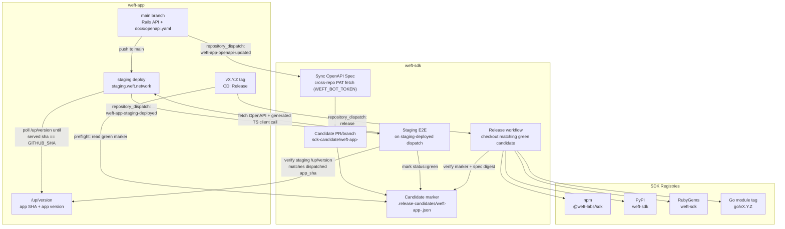
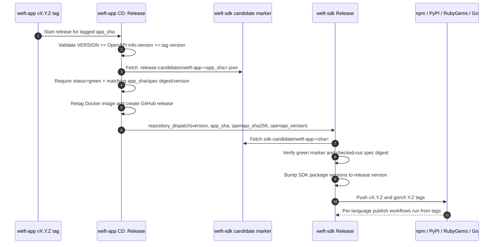
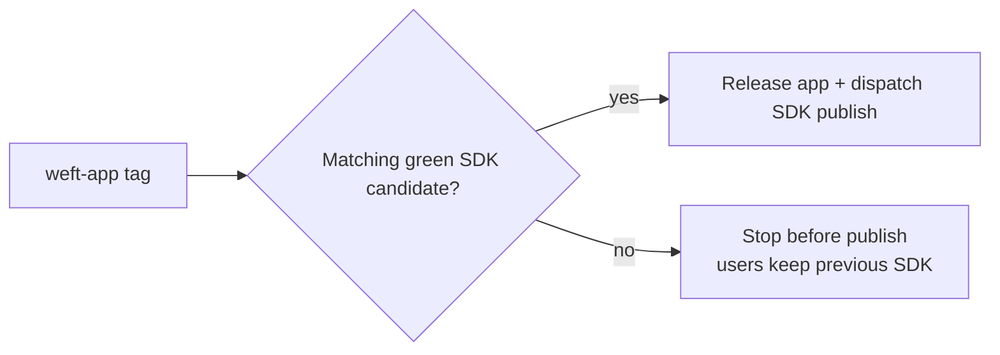

# SDK Pipeline Architecture — Candidate-Led Release

> **STALE (2026-05-27).** This document describes the previous candidate-led
> design with `.release-candidates/weft-app-<sha>.json` markers. **The marker
> pattern is retired in spec S2** of the active plan — auto-PRs gated by their
> own check status (per-language build/test + staging e2e job in `e2e.yml`)
> replace the marker JSON and the separate `staging-e2e.yml` workflow. See
> `cto-os/plans/active/2026-05-27-sdk-release-pipeline-decoupled.md` and the
> current `README.md` "Release Candidates" section. Full architecture rewrite
> follows under spec S6.
>
> Visual reference for the SDK release pipeline.
>
> **Implemented by:**
> - `weft-app` PR #275 + weft-sdk PR #2 (2026-04-28) — initial candidate-led architecture
> - `weft-sdk` PR #3 (2026-05-01) — fine-grained PAT (`WEFT_BOT_TOKEN`) replaces GitHub App for cross-repo auth
> - `weft-sdk` PR #5 (2026-05-01) — `bump-version.sh` refreshes Ruby `Gemfile.lock`
> - `weft-app` PR #280 + `weft-sdk` PR #7 (2026-05-02) — staging-deployed dispatch closes the staging-vs-e2e race
>
> **Active plan:** [`plans/active/2026-04-sdk-pipeline-production-readiness.md`](../../../cto-os/plans/active/2026-04-sdk-pipeline-production-readiness.md). Predecessor plans are in `cto-os/plans/done/`.

---

## TL;DR

The SDK pipeline separates **SDK source generation** from **registry publishing**.
Every `weft-app` SHA gets a deterministic SDK candidate generated from that
SHA's OpenAPI spec, then e2e-validated against staging. A release can publish
only the green SDK candidate that matches the tagged `weft-app` SHA.

Core invariant:

> `weft-app@<sha>` can release only with `weft-sdk` candidate
> `.release-candidates/weft-app-<sha>.json` marked `green`.

---

## System Topology



> Two distinct repository_dispatch events from weft-app drive the candidate flow:
> - `weft-app-openapi-updated` — fires immediately on push to main, drives spec sync + candidate PR creation.
> - `weft-app-staging-deployed` — fires *after* `cd_staging-deploy` polls `/up/version` and confirms staging serves the new SHA. Drives staging-e2e. **This decoupling closes the race** where staging-e2e ran on candidate PR open while staging was still rolling out.

---

## Candidate Generation Flow

```mermaid
sequenceDiagram
    autonumber
    participant App as weft-app main
    participant Deploy as weft-app cd_staging-deploy
    participant Staging as weft-app staging
    participant Sync as weft-sdk sync-spec.yml
    participant Candidate as sdk-candidate/weft-app-<sha>
    participant E2E as weft-sdk staging-e2e.yml
    participant Marker as .release-candidates/weft-app-<sha>.json

    par Spec sync (immediate)
        App->>Sync: repository_dispatch:\nweft-app-openapi-updated\n(app_sha, openapi_sha256, openapi_version, spec URL)
        Sync->>App: Fetch docs/openapi.yaml via PAT (WEFT_BOT_TOKEN)\nContents API authenticated read
        Sync->>Sync: Validate fetched spec digest matches payload
        Sync->>Sync: bump-version.sh aligns 4 SDKs incl. ruby/Gemfile.lock
        Sync->>Sync: Regenerate TS/Python/Ruby/Go SDKs
        Sync->>Candidate: Push deterministic candidate branch and open/update PR
        Sync->>Marker: Write candidate marker with status=pending
    and Staging deploy (slow)
        App->>Deploy: push to main triggers cd_staging-deploy
        Deploy->>Staging: kamal deploy --destination staging
        Deploy->>Staging: kamal db:migrate (if migrations)
        loop until /up/version reports app_sha (max 10 min)
            Deploy->>Staging: GET /up/version
        end
        Deploy->>E2E: repository_dispatch:\nweft-app-staging-deployed\n(app_sha, openapi_sha256, openapi_version)
    end

    Note over E2E: Triggered only after both par branches\nhave produced their artifacts: candidate exists\n(from Sync) AND staging serves SHA (from Deploy)
    E2E->>Candidate: Checkout sdk-candidate/weft-app-<short_sha>
    E2E->>Staging: Re-verify /up/version matches dispatched app_sha
    E2E->>Staging: Generated TypeScript client fetches the OpenAPI document (/docs/openapi.yaml);\nverify served openapi sha256 matches dispatch
    E2E->>Staging: Generated authenticated client calls /api/v1/me with invalid token (expects 401)
    E2E->>Marker: If checks pass, write status=green + e2e_run_url\nvia explicit PAT-authed remote URL push
```

Candidate marker shape:

```json
{
  "app": "weft-app",
  "app_sha": "<40-char sha>",
  "app_short_sha": "<12-char sha>",
  "openapi_sha256": "<spec digest>",
  "openapi_version": "<version>",
  "sdk_ref": "sdk-candidate/weft-app-<sha>",
  "status": "pending | green | red",
  "e2e_run_url": "<github actions run>"
}
```

---

## Release Promotion Flow



Release failure rule:



---

## Responsibilities

| Component | Responsibility | Does Not Do |
|---|---|---|
| `weft-app/docs/openapi.yaml` | Canonical API contract | Publish SDK packages |
| `weft-app/VERSION` | Canonical release version; gates `cd_openapi-dispatch` and `cd_staging-deploy` notify against `info.version` | Override `openapi.yaml` |
| `weft-app cd_openapi-dispatch.yml` | On push to main: emits `weft-app-openapi-updated` to weft-sdk with immutable provenance | Test or release |
| `weft-app cd_staging-deploy.yml` | Builds image, deploys via Kamal, polls `/up/version` until staging serves the new SHA, then emits `weft-app-staging-deployed` to weft-sdk | Run any SDK code |
| `WEFT_BOT_TOKEN` (weft-sdk repo secret) | Fine-grained PAT — `weft-app contents:read` + `weft-sdk contents:write,pull_requests:write`. Used by sync-spec for cross-repo spec fetch and by both sync + e2e for explicit-URL git pushes | Run jobs / sign App tokens |
| `weft-sdk/sync-spec.yml` | Fetches private spec via PAT, validates payload, regenerates SDKs (incl. Ruby `Gemfile.lock`), opens/updates candidate PR with pending marker | Write directly to `main` |
| Candidate branch (`sdk-candidate/weft-app-<short_sha>`) | Holds generated SDK output for one `weft-app` SHA | Represent multiple app SHAs |
| Candidate marker (`.release-candidates/weft-app-<full_sha>.json`) | Records app SHA, spec digest, SDK ref, e2e status, e2e_run_url | Prove runtime behavior by itself |
| `weft-sdk/staging-e2e.yml` | Triggered by `weft-app-staging-deployed` only. Re-verifies `/up/version`, exercises generated TS client against staging, marks marker green | Run on PR open or block on staging being unready |
| `weft-app CD: Release` | On `vX.Y.Z` tag: validates VERSION/spec/tag triplet, fetches matching green marker, retags Docker image, dispatches release to weft-sdk | Generate SDKs |
| `weft-sdk Release` | Publishes only the matching green candidate to npm/PyPI/RubyGems/Go | Pick mutable `main` as release input |

---

## Why This Pattern

- **Repo update and registry publish are separate events.** API changes can keep
  SDK source current without publishing a public package immediately.
- **The release input is immutable.** The SDK release uses a candidate tied to
  `app_sha`, not whatever happens to be on `weft-sdk/main`.
- **Staging is a provenance gate.** E2E first checks `/up/version`, so tests do
  not accidentally pass against the wrong deployed app.
- **Race-free e2e triggering.** `staging-e2e.yml` does not fire on candidate PR
  open. It fires on a `weft-app-staging-deployed` `repository_dispatch` emitted
  by `cd_staging-deploy.yml` *after* it has polled `/up/version` and confirmed
  the new SHA is being served. Eliminates the previous race where e2e ran while
  staging was still rolling out.
- **Failures stop promotion, not users.** If staging or SDK e2e is red, release
  blocks before registries change; users keep the previous published SDK.
- **PR-first workflow stays intact.** Generated SDK updates go through candidate
  PRs instead of direct writes to `main`.
- **PAT auth scoped to two specific shell steps.** `WEFT_BOT_TOKEN` is consumed
  only by the spec-fetch curl in sync and the marker-push `git remote set-url`
  in both sync and e2e. `actions/checkout` runs with `persist-credentials: false`,
  so `npm install` lifecycle scripts cannot read either GITHUB_TOKEN or PAT
  credentials from the runner's git config.

---

## Related

- Active plan: [`plans/active/2026-04-sdk-pipeline-production-readiness.md`](../../../cto-os/plans/active/2026-04-sdk-pipeline-production-readiness.md)
- Predecessor plans (archived): `../../../cto-os/plans/done/2026-04-sdk-pipeline-{candidate-release,complete,post-pivot-audit}.md`
- Original auth spec (long-term GitHub-App option, not currently in code): [`specs/sdk-pipeline/02-spec-sync-auth.md`](../specs/sdk-pipeline/02-spec-sync-auth.md)
- Superseded proposal: [`plans/scoped/2026-04-sdk-pipeline-v2-staging-aligned.md`](../../../cto-os/plans/scoped/2026-04-sdk-pipeline-v2-staging-aligned.md)

### Implementing PRs

- `weft-app` PR [#275](https://github.com/weft-labs/weft-app/pull/275) — gate releases on green SDK candidates
- `weft-sdk` PR [#2](https://github.com/weft-labs/weft-sdk/pull/2) — candidate-gated release pipeline
- `weft-sdk` PR [#3](https://github.com/weft-labs/weft-sdk/pull/3) — swap GitHub App auth for fine-grained PAT
- `weft-sdk` PR [#5](https://github.com/weft-labs/weft-sdk/pull/5) — refresh `ruby/Gemfile.lock` in `bump-version.sh`
- `weft-app` PR [#280](https://github.com/weft-labs/weft-app/pull/280) — poll `/up/version`, then notify weft-sdk
- `weft-sdk` PR [#7](https://github.com/weft-labs/weft-sdk/pull/7) — staging-e2e on staging-deployed dispatch (drops PR-open trigger)
