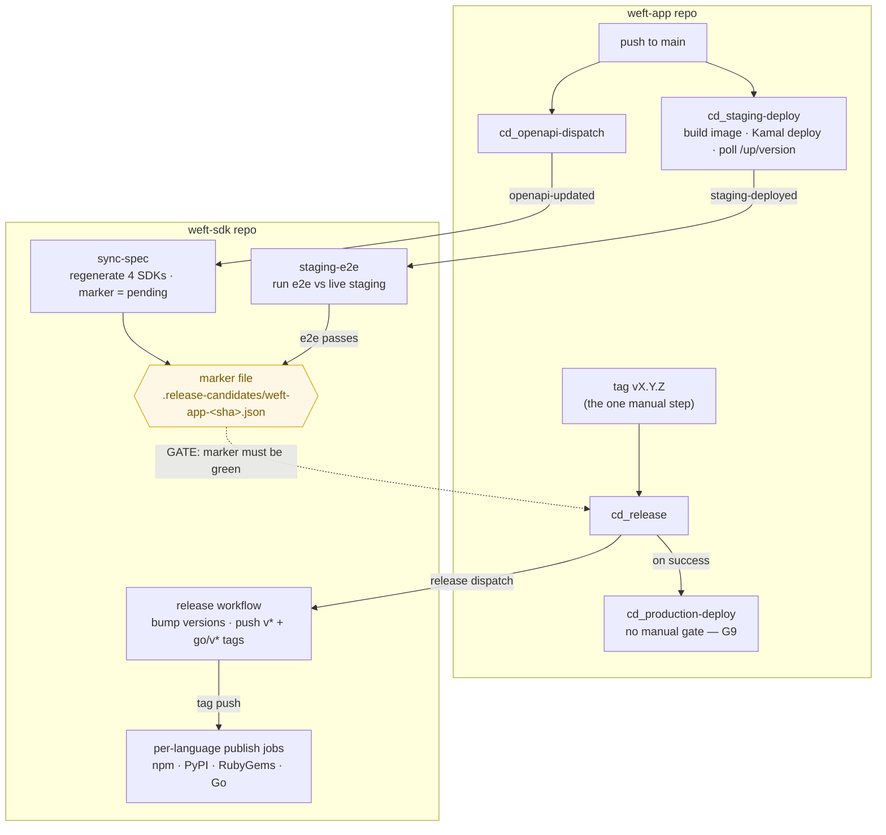
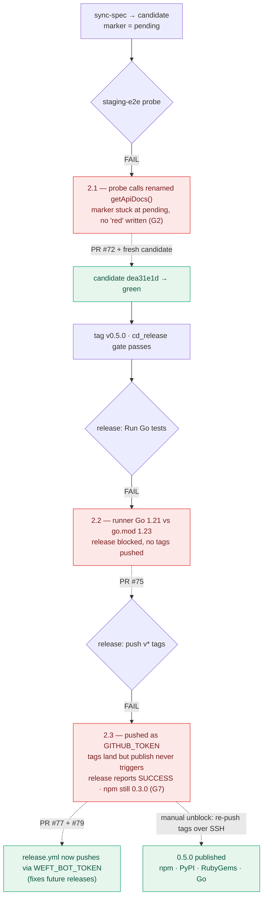

  # SDK ↔ weft-app release pipeline — overview and hardening review

> **Status:** Review (2026-05-19). Written because the v0.5.0 release surfaced a
> structural gap. Plain-English companion to the diagram-heavy canonical
> reference: [`architecture/sdk-pipeline.md`](../architecture/sdk-pipeline.md).
> Recommendations in section 4 belong in [`plans/active/2026-04-sdk-pipeline-production-readiness.md`](../../../cto-os/plans/active/2026-04-sdk-pipeline-production-readiness.md).
>
> **Update (2026-05-19, later same day):** the v0.5.0 release was driven all the
> way through after this doc's first draft. It surfaced **two further
> independent failures** in the release→publish leg — the leg the first draft
> assumed worked. Sections 2.2–2.4, gaps G5–G9, recommendations R6–R10, and
> section 5 were added from that. The TL;DR has been rewritten: the original
> claim ("the goal is already enforced") was true only for the half of the
> pipeline that had ever run.

## TL;DR

The pipeline's *intent* is sound and worth keeping: the SDK is exercised against
the live staging deployment before weft-app can reach production, as a hard gate
rather than a convention.

But driving v0.5.0 end-to-end showed the pipeline **had never completed a
release**. Since the candidate-gated `release.yml` was introduced (2026-04-28),
not one SDK has published through it: 0.4.0's release failed outright (npm has
no 0.4.0), and 0.5.0 was the first real attempt to traverse the release+publish
leg. It hit **three independent bugs in a row**:

1. the staging-e2e probe rotted on an `operationId` rename — the candidate
   parked at `pending` (the original finding, section 2.1);
2. `release.yml` pinned Go 1.21 while the generated `go.mod` requires 1.23, so
   `go test` failed and blocked tagging (section 2.2);
3. `release.yml` pushed the release tags with the default `GITHUB_TOKEN`, which
   GitHub refuses to let trigger other workflows — so the per-language `publish`
   jobs never ran and the workflow reported `success` having published nothing
   (section 2.3).

The real lesson is not "one brittle link." It is that **only the first half of
the pipeline (sync + staging-e2e, which runs on every push) had ever executed.
The release+publish half runs only on a tag, was never exercised, and shipped
broken.** A pipeline leg that has never run green is not a pipeline — it is
unrun code. v0.5.0 reached npm / PyPI / RubyGems / Go only after manual
intervention (section 2.3).

One more correction: this doc's first draft (and the architecture diagram) said
`cd_production-deploy` requires manual approval via the `production` GitHub
Environment. It **does not** — that environment has no protection rules. Prod
ships automatically on release success (gap G9).

## 1. The pipeline in plain words

Two repos, two triggers, one contract file. The whole thing at a glance:



Solid arrows are automatic. The dashed arrow is the **hard gate**: `cd_release`
refuses to run unless the marker for the tagged SHA is `green`. `tag vX.Y.Z` is
the only manual step. The two halves — *left of the tag* (sync + e2e, runs on
every push) and *right of the tag* (release + publish, runs only on a tag) — are
the crux of section 5: only the first half had ever actually run.

### Trigger A — push to `weft-app` `main`

Three workflows fire on every push:

- **`ci_main`** — runs the test suite.
- **`cd_staging-deploy`** — builds the Docker image tagged with the commit SHA,
  deploys it to staging via Kamal, then polls `staging.weft.network/up/version`
  until staging *actually serves that SHA*. Only then does it ping weft-sdk with
  a `weft-app-staging-deployed` event.
- **`cd_openapi-dispatch`** — pings weft-sdk with a `weft-app-openapi-updated`
  event carrying the new spec's URL, digest, and version.

Those two pings drive two weft-sdk workflows:

- **`sync-spec`** (on `openapi-updated`) — pulls the new OpenAPI spec,
  regenerates all four SDKs (TypeScript / Python / Ruby / Go), pushes a
  deterministic candidate branch `sdk-candidate/weft-app-<sha>`, opens a
  candidate PR, and writes the **marker file**
  `.release-candidates/weft-app-<sha>.json` with `status: pending`.
- **`staging-e2e`** (on `staging-deployed`) — checks out that candidate branch,
  confirms staging is serving the expected SHA, builds the TypeScript SDK, runs
  `scripts/e2e-typescript-staging.mjs` against live staging, and — if it passes —
  flips the marker to `status: green` and auto-merges the candidate PR.

The marker is the contract between the repos. `green` means: *the SDK generated
from this exact weft-app commit was exercised against the live staging
deployment of that same commit, and it worked.*

### Trigger B — tag `vX.Y.Z` on `weft-app`

- **`cd_release`** validates the version triple (`tag` == `VERSION` ==
  `openapi.yaml` `info.version`), then **refuses to continue unless the green
  marker for the tagged SHA exists**. If green: it retags the Docker image as
  `:VERSION` / `:latest`, cuts the GitHub Release, and dispatches a `release`
  event to weft-sdk.
- **weft-sdk `release`** checks out the green candidate, bumps package versions,
  and pushes `vX.Y.Z` + `go/vX.Y.Z` tags. The per-language workflows are *meant*
  to trigger on those tags and publish to npm / PyPI / RubyGems / Go — but see
  section 2.3: this is the step that was silently broken.
- **`cd_production-deploy`** fires after `cd_release` *succeeds* (chained via
  `workflow_run`). It declares `environment: production`, but that environment
  has **no protection rules** — so there is no manual gate (gap G9). Kamal then
  deploys to production automatically.

### Is the SDK tested in staging before prod? Yes — by construction

The chain cannot be skipped — trace it on the diagram above:

Prod is gated behind release success; release is gated behind the green marker;
the marker is gated behind a passing staging e2e. **That gate works.** What did
*not* work is everything the `release` dispatch is supposed to do after it —
see section 2.

## 2. What broke for v0.5.0 — the full sequence

Three independent failures, in three different legs, each hit the *first* time
that leg ran for this release.



Red boxes are the three failures; dashed arrows are the fixes. Note the shape:
each red box sits in a *different leg*, and each fired the first time that leg
executed. That pattern is the subject of section 5.

### 2.1 — staging-e2e probe rotted (the original finding)

The candidate for the v0.5.0 SHA sat at `pending` indefinitely.

Root cause: `scripts/e2e-typescript-staging.mjs` is **hand-written and lives on
weft-sdk `main`**, but it calls the *generated* client by method name. weft-app
PRs #337 / #339 renamed the OpenAPI operation `getApiDocs` → `getOpenApiDocument`
(and moved its path). The regenerated client no longer exposes `getApiDocs()`,
so the e2e crashed on its first call with `TypeError: api.getApiDocs is not a
function` — three runs in a row.

A crash leaves the marker at `pending`: there is **no code path that writes
`red`**. So a pipeline that had run and failed three times was indistinguishable
from one that had never run. Staging itself was healthy — `check-staging-candidate.sh`
passed every time. This was pure stale-glue rot.

A second, separate bug surfaced alongside it: weft-sdk's own
`typescript/tests/generated-exports.test.ts` still asserted the now-dropped
`AgentsApi`, so the TypeScript SDK CI had been red on `main` since the spec sync.

Both are fixed in **weft-sdk PR #72**.

### 2.2 — `release.yml` pinned Go 1.21; generated `go.mod` needs 1.23

Once a fresh candidate (`sdk-candidate/weft-app-dea31e1d2070`) went green and the
`v0.5.0` tag was pushed on weft-app, `cd_release` passed its gate and dispatched
the `release` event. weft-sdk `release.yml` then ran — for the first time under
the candidate-gated design (see G5) — and failed at `Run Go tests`:

```
go: go.mod requires go >= 1.23 (running go 1.21.13; GOTOOLCHAIN=local)
```

`release.yml` set `actions/setup-go` to `1.21`. `go.yml` already used `1.23`.
The generated `go/go.mod` declares `go 1.23`. Three places, two values, no
shared source (gap G8). The failure happens *before* `Commit release version
bump` and `Create and push tags` — so no tag, no publish.

Fixed: **weft-sdk PR #75** (bump `release.yml` to Go 1.23).

### 2.3 — `release.yml` pushed tags with `GITHUB_TOKEN`; publish never triggered

With the Go fix merged and the `release` event re-dispatched, `release.yml` ran
fully green — and *still published nothing*. npm stayed at 0.3.0.

The per-language `publish` jobs (`typescript.yml`, `python.yml`, `ruby.yml`,
`go.yml`) are gated on `if: startsWith(github.ref, 'refs/tags/v')` and trigger
on the tag push. But `release.yml`'s `Create and push tags` step pushed using
the default `GITHUB_TOKEN` (persisted into git config by `actions/checkout`).
**GitHub deliberately does not trigger new workflow runs from events created by
`GITHUB_TOKEN`** — a recursion guard. So the tags landed, the release run
reported `success`, and no `publish` job ever started (gap G6).

`sync-spec.yml` already knew this — it pushes candidate branches with
`WEFT_BOT_TOKEN` "so normal PR CI can run on bot-authored branches."
`release.yml` did not apply the same lesson.

Fixed across **weft-sdk PR #77 + PR #79**:

- #77 switched the push to a `WEFT_BOT_TOKEN`-authed remote URL. **It was not
  enough on its own** — `actions/checkout` persists a
  `http.https://github.com/.extraheader` Authorization header carrying the
  `GITHUB_TOKEN`, and git attaches that header to the bot-token URL where it
  *overrides* the URL credentials. The push still authenticated as
  `GITHUB_TOKEN`.
- #79 unsets that `extraheader` immediately before the push, so the
  URL-embedded bot token is the only credential.

v0.5.0 itself was unblocked by deleting and re-pushing the `v0.5.0` /
`go/v0.5.0` tags from a developer machine over SSH — a real-user push *does*
trigger the publish workflows. As of 2026-05-19, npm `@weft-labs/sdk`, PyPI
`weft-sdk`, RubyGems `weft-sdk`, and the Go module `go/v0.5.0` all serve 0.5.0,
and weft-app v0.5.0 deployed to production.

### 2.4 — the candidate SHA moved mid-incident

This doc's first draft named the v0.5.0 candidate as `025f4c64…`. By the time
the release was driven through, weft-app `main` had advanced; the released SHA
is `dea31e1d…` and its candidate `sdk-candidate/weft-app-dea31e1d2070` was the
one that went green. The earlier candidate PRs (#71 and similar) are now stale
duplicates and should be closed — `sync-spec` opens one per main push and
nothing prunes the losers (a minor housekeeping leak, not tracked as a gap).

## 3. Structural gaps

Why a one-line spec change — and then an untested release leg — could silently
park, then silently no-op, a release:

| # | Gap | Consequence |
|---|-----|-------------|
| G1 | The e2e probe is **unversioned hand-written glue** that references the generated client by method name, never regenerated, never type-checked against it. | Any `operationId` / path rename in weft-app's spec rots it silently. |
| G2 | A crashed e2e never writes `status: red` — the marker stays `pending` with an empty `e2e_run_url`. | "Never ran" and "ran and failed" look identical. The release gate blocks correctly, but gives no *why*. |
| G3 | No alert on staging-e2e failure. | A failed release parks with zero notification. v0.5.0 was only caught because the release was being chased by hand. |
| G4 | `staging-e2e` enables candidate-PR auto-merge once *required* checks pass; the TS `generated-exports` test was red but evidently not required. | Red SDK code auto-merged to weft-sdk `main`. |
| G5 | The candidate-gated `release.yml` (in place since 2026-04-28) **had never run to a published artifact**. Its Go-version and token bugs were latent because the leg was never exercised; 0.4.0's release failed and nobody noticed it never published. | Half the pipeline was declared done while never having executed. v0.5.0 was its first real run — and it failed twice. |
| G6 | Tags pushed with `GITHUB_TOKEN` do not trigger downstream workflows; `release.yml` relied on exactly that to fire the per-language `publish` jobs. | A structurally guaranteed no-op. The fix pattern (`WEFT_BOT_TOKEN`) already existed in `sync-spec.yml` but was not applied to `release.yml`. |
| G7 | `release.yml` ends at "push tags" and **never verifies the artifacts published**. The job reports `success` whether or not npm / PyPI / RubyGems / Go received the version. | A "successful" release that ships nothing — indistinguishable from a real one without manually checking each registry. |
| G8 | The Go toolchain version is declared in three places (`release.yml`, `go.yml`, generated `go/go.mod`) with no shared source. | Drift goes unnoticed until `go test` fails mid-release. |
| G9 | The architecture doc / diagram claim `cd_production-deploy` requires manual approval via the `production` environment. That environment has **no protection rules** (`protection_rules: []`). | A believed safety gate does not exist — prod ships automatically on release success. Docs and config disagree. |

## 4. Recommendations (ranked)

R1–R5 address the staging-e2e leg (the original draft). R6–R10 address the
release+publish leg surfaced by the full v0.5.0 run.

**R1 — Type-check the e2e probe against the freshly generated client, on the
candidate PR.** Add a step to `sync-spec` (or a required candidate-PR check)
that compiles `e2e-typescript-staging.mjs` against the regenerated TypeScript
client. A spec rename then fails the candidate PR *immediately*, with a clear
error, instead of failing silently at staging-e2e time. This is the highest-value
fix for the e2e leg — it catches G1 at the earliest possible point.

**R2 — Write `status: red` + `e2e_run_url` on e2e failure.** Add a failure-path
step to `staging-e2e.yml` so a failed run records `red` with its run URL. Makes
G2 visible: a stuck pipeline becomes debuggable from the marker alone.

**R3 — Notify on staging-e2e failure.** A failed e2e should open a GitHub issue
or ping a channel. Closes G3 — no more silent parking.

**R4 — Make per-language SDK build + test required checks on candidate PRs.**
Prevents red SDK code from auto-merging to weft-sdk `main`. Closes G4.

**R5 — Reduce hand-written glue that names generated symbols.** The probe only
exercises a couple of endpoints; pin it to operations unlikely to churn, or
derive the probe list from the spec. Lower priority — R1 makes rot loud, which
captures most of the value.

**R6 — Verify published artifacts before `release.yml` reports success.** After
the tag push, poll npm / PyPI / RubyGems / the Go proxy for the new version and
fail the job if any is missing. A green release must mean the artifacts exist.
Closes G7 — and would have caught both 2.2 and 2.3 the moment they happened.

**R7 — Exercise the release+publish leg outside a real release.** This leg first
ran in anger on a customer-facing version bump. Add a dry-run path (per-ecosystem
`--dry-run` / a disposable prerelease tag / publish to a scratch registry) wired
into CI so the leg is proven green *before* it is needed. Closes G5. This is the
structural fix — see section 5.

**R8 — Single source of truth for the Go toolchain version.** Read it from
`go/go.mod` (or a shared `.tool-versions` / env) in every workflow rather than
hardcoding `setup-go` versions. Closes G8.

**R9 — Push release tags with `WEFT_BOT_TOKEN`; make it a written rule.** Already
fixed for `release.yml` (#77 / #79). Add a one-line directive: any workflow
whose pushed ref must trigger further CI uses `WEFT_BOT_TOKEN`, never
`GITHUB_TOKEN`, and unsets the persisted `checkout` extraheader first. Closes G6.

**R10 — Decide the prod-deploy gate explicitly.** Either add required reviewers
to the `production` environment (if a human gate is wanted) or correct this doc
and `reference/architecture/sdk-pipeline-architecture.md` to state prod ships
automatically. Right now the docs and the config disagree. Closes G9.

R1–R4, R6, R8–R10 are small, mechanical workflow/script changes. R5 and R7 are
larger. All should be added as hardening tracks to
`plans/active/2026-04-sdk-pipeline-production-readiness.md` — but see section 5
on whether that plan's scope is even the right frame.

## 5. The planning problem — why this needs a rethink, not just patches

The recommendations above are real, but treating them as a checklist repeats the
mistake that caused this. The deeper issue is *how the pipeline was planned and
declared done*.

- **It was called complete while half of it had never run.** The pipeline was
  described as "enforcing the goal" because the sync + staging-e2e leg — which
  runs on every push to `main` — works. The release + publish leg runs only on
  a `vX.Y.Z` tag: rare, off CI's normal path, and never once exercised under
  the candidate-gated design. "Verified" silently meant "the frequently-run
  half is verified."
- **Every failure was a different leg failing the first time it ran.** G1, then
  G5/G6 (Go version, token). That is the signature of a pipeline *assembled and
  reasoned about* rather than *exercised end-to-end*. Three bugs did not appear
  because the pipeline degraded; they were always there, waiting for the first
  traversal.
- **A "successful" run that ships nothing was possible by design.** G7 is not an
  edge case — it is the absence of the one check that would have made any of
  this loud. The pipeline optima for "the steps ran" over "the outcome
  happened."
- **The map and the territory diverged.** G9: a manual prod gate was documented
  and diagrammed but never configured. Planning produced a description of a
  pipeline that was never reconciled against the deployed config.

**The rule a rethink should start from:** no leg of the release pipeline is
"done" until it has executed green end-to-end at least once — on a dry-run if
not a real release — *and* a post-condition check proves the intended outcome
(artifact on the registry, service serving the SHA), not merely that the steps
exited 0.

`plans/active/2026-04-sdk-pipeline-production-readiness.md` is currently scoped
to the e2e-probe class of problem (R1–R5). That scope is too narrow: it would
have hardened the leg that *did* eventually work and left the leg that *never
worked* untouched. The plan must either be widened to own the release+publish
leg (R6–R10) and the dry-run requirement (R7), or the pipeline should be
re-planned from scratch — the founder's call. Recommended: a fresh planning
pass, because the failure here was the planning model, not any single workflow.

## 6. Related

- Canonical architecture + diagrams: [`architecture/sdk-pipeline.md`](../architecture/sdk-pipeline.md)
  — needs correcting for G9 (no manual prod gate) and the publish-leg reality.
- Active plan: [`plans/active/2026-04-sdk-pipeline-production-readiness.md`](../../../cto-os/plans/active/2026-04-sdk-pipeline-production-readiness.md)
  — scope must widen (section 5) or be superseded.
- Incident fixes:
  - weft-sdk PR #72 (`fix/e2e-staging-getopenapidocument`) — staging-e2e probe + `generated-exports` test.
  - weft-sdk PR #75 — `release.yml` Go 1.21 → 1.23.
  - weft-sdk PR #77 + #79 — `release.yml` tag push via `WEFT_BOT_TOKEN` (and the `extraheader` override fix).
  - weft-app PR #345 — `docs/api-reference.md` regenerated against the v0.5.0 OpenAPI + published SDK.
- v0.5.0 outcome: weft-app `v0.5.0` released + deployed to production; SDK 0.5.0
  published to npm / PyPI / RubyGems / Go.
